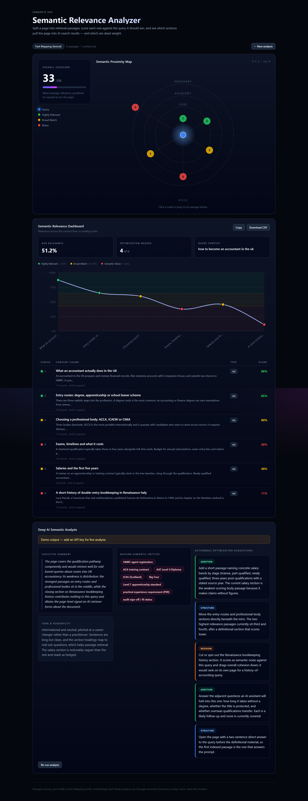

# Semantic Relevance Analyzer

Splits a page into retrieval passages, scores each one against a target query by vector proximity, and shows which sections would pull the page into AI search results — and which are dead weight.



Three result blocks, top to bottom:

1. **Semantic Proximity Map** — the query at the centre, passages orbiting it at a radius proportional to `1 − similarity`, with dashed CORE / ADJACENT / PERIPHERY / NOISE rings, plus the Overall Cohesion index.
2. **Semantic Relevance Dashboard** — relevance across the content flow, a passage table with expandable full text, and Copy / CSV export.
3. **Deep AI Semantic Analysis** — Claude reads the scored passages and returns the executive summary, tone read, missing entities, and concrete optimization suggestions.

## Run it

```bash
npm install
npm run dev        # http://localhost:5173
```

`npm run dev` also serves the `api/` serverless functions through a small Vite middleware ([scripts/devApiPlugin.ts](scripts/devApiPlugin.ts)), so URL fetching, embeddings and Claude analysis all work locally without `vercel dev`.

```bash
npm run build      # tsc -b (app + api + config projects) && vite build
npm run preview
```

**Click-through in one step:** press **Try demo** on the form, then **RUN SEMANTIC ANALYSIS**. It loads a target query (`how to become an accountant in the uk`) and a six-section article whose last section is deliberately off-topic, so all three relevance bands and all three result blocks are populated without supplying your own data.

## Deploy

```bash
vercel deploy
```

No manual setup: [vercel.json](vercel.json) pins the Vite framework preset and builds every `api/*.ts` file as a Node function. The app is fully functional with **no environment variables at all** — it falls back to lexical scoring and an offline analysis, and says so in the UI.

| Variable | Effect |
| --- | --- |
| `ANTHROPIC_API_KEY` | Enables live Deep AI Analysis and Claude-generated Semantic Context for every visitor. Without it the button still works and returns an offline analysis computed from your own passage scores (see below). |
| `ANTHROPIC_MODEL` | Overrides the model (default `claude-sonnet-4-6`). |
| `EMBEDDINGS_API_KEY` | Enables the Embedding-based scoring mode. |
| `EMBEDDINGS_API_URL` | OpenAI-compatible base URL (default `https://api.openai.com/v1`). Works with OpenAI, Voyage, Mistral, Together, or a self-hosted text-embeddings-inference server. |
| `EMBEDDINGS_MODEL` | Default `text-embedding-3-small`. |

Keys never reach the browser: every external call goes through `api/`. A key pasted into the form field is held in React state and sent per-request to the serverless function only — never stored.

## How the scoring works

The pipeline lives in [src/lib](src/lib), separate from the UI: [chunker.ts](src/lib/chunker.ts) → [scorer.ts](src/lib/scorer.ts) → [metrics.ts](src/lib/metrics.ts), orchestrated by [pipeline.ts](src/lib/pipeline.ts).

**Chunking.** Headings start a new passage (`#`/`##` markdown, HTML `<h1>`–`<h6>` preserved as markdown by the fetcher, or a bare title-like line in pasted prose). Long runs of prose are split on paragraph boundaries into ~150–400 word passages — the size a retrieval system actually indexes. Parent headings with no body of their own are folded into the next passage, and fragments under 12 words are merged into a neighbour so the map has no dust points.

**Mode A — Fast Mapping (lexical).** The default. No key required, runs entirely in the browser. Over a stemmed unigram + bigram space it blends three signals:

- `cov` — BM25-saturated, IDF-weighted share of the literal query terms a passage covers.
- `topical` — the same measure against the page's *own* topic vocabulary (its highest TF-IDF terms), gated by `sqrt(docCov)`, where `docCov` is the whole page's literal query coverage. This is what lets "ACCA exam exemptions" rank as on-topic for "become an accountant" despite zero literal overlap, while the gate keeps the scale absolute: on a page that never mentions the query, the topic term contributes nothing and every passage correctly reads as noise.
- `phrase` — query bigram coverage.

**Be honest about what this is.** Lexical scoring measures wording overlap, not meaning — two passages that say the same thing in different words score apart, and no amount of stemming fixes that. The blend weights and the final 0–100 calibration in `LEXICAL_CALIBRATION` are exactly that, a calibration: raw lexical similarity for a six-word query against a 300-word passage lives in a narrow low band, and the constants map it onto the scale the 65 / 43 thresholds are defined against. They were tuned against the demo article, a real fetched Wikipedia page, and an unrelated control page (which correctly scores 0). The UI labels this mode *Fast Mapping (lexical)* everywhere it appears, including on the results badge.

**Mode B — Embedding-based.** Selected in the Vector Algorithm dropdown. Sends the query and every passage to [api/embed.ts](api/embed.ts), which calls an OpenAI-compatible `/embeddings` endpoint, and scores by true cosine similarity. Because embedding cosines land in a narrow band, they are stretched onto the same 0–100 scale by `EMBEDDING_CALIBRATION`. Anthropic serves no embeddings endpoint, so an `sk-ant-` key cannot drive this mode — paste an OpenAI-compatible key instead, or configure the server env. **If embeddings are unavailable for any reason the run does not fail:** it falls back to lexical scoring, flips the badge, and shows exactly why.

**Thresholds and metrics.** Highly Relevant ≥ 65, Broad Match 43–64, Semantic Noise 0–42. *Avg Relevance* is the mean passage score; *Overall Cohesion* is that mean penalised for spread (a page alternating between 90% and 20% retrieves worse than an even page with the same average); *Optimization Needed* counts passages below 65.

## Extending it: competitor semantic maps

The same vector space generalises to Dan Hinckley's comparative map — place your pages, your competitors' pages and the keyword in one embedding space and plot the clusters, so you can see which competitor owns the semantic centre of the topic and where your coverage has a hole. `api/embed.ts` already batches arbitrary text sets, so this is largely a UI and layout problem rather than a pipeline one.

## Project layout

```
api/            serverless functions: fetch-url, embed, analyze, autofill
src/lib/        pipeline — chunker, scorer, metrics, csv, api client, demo data
src/components/ ConfigForm, ProgressScreen, ProximityMap, RelevanceDashboard, ChunkTable, DeepAnalysis
scripts/        Vite dev middleware that runs api/ locally
```

TypeScript is strict across three project references (app, api, build scripts); `npm run build` type-checks all of them. The layout is responsive down to 375px: the cohesion card and map stack, the chart and passage table scroll horizontally, and the form collapses to one column.

## On the AI-assisted process

This was built specification-first: the brief was turned into the module boundaries above before any component was written, so the scoring pipeline could be developed and tuned independently of the UI. The scorer in particular was not accepted on the first generation — its output was measured against the demo article, a live Wikipedia fetch and a deliberately unrelated control page, and the formulation was rewritten twice (in-document IDF was crushing the topical terms; pseudo-relevance feedback rated its own seed passage at 100% and everything else at nothing) before the score distribution was defensible. Every diff was reviewed rather than accepted wholesale, and the finished build was driven end-to-end in a real browser at 1440px and 375px to check the result against the reference screenshots.

## The Deep AI block without a key

With `ANTHROPIC_API_KEY` set (or a key pasted into the form), the scored passages go to Claude, which returns the executive summary, tone read, missing entities and suggestions.

Without any key the button still works, but it runs [offlineAnalysis.ts](src/lib/offlineAnalysis.ts) instead — an analysis computed from *this run's own* passages and scores. It names your strongest and weakest passages, reports which query terms the page under-uses and in how many passages, and derives its suggestions from the actual shape of the data (lowest-scoring passage, position of the strongest passage, over-long passages, share below threshold).

It is deliberately weaker than the Claude path and the UI says so: a local heuristic can measure coverage and structure, but it cannot name an entity the page never mentions — that needs a model with world knowledge. What it will never do is describe content you did not submit.

### Testing the live path without a key

Type `test` (or `demo` / `mock`) into the AI API Key field. The request goes to `/api/analyze` and runs the entire live path — validation, a Claude-shaped JSON payload, the same `parseJsonObject` + `normalise` the real response goes through, the loading state, the three-column render — but no model is called and nothing is charged. The mock deliberately includes a suggestion with an invalid `type` to prove the normaliser coerces it rather than crashing.

The result is flagged `mock: true` and the UI shows a blue banner saying so, distinct from both the amber offline banner and an unbannered real response. **Mock text is filler**: it echoes your query and your best and worst passage titles, but it is not a reading of your content. Only a real key gives you that.

Three ways the block can resolve, all reachable from the form:

| Key field | Path | Banner |
| --- | --- | --- |
| empty | offline heuristic, computed locally | amber |
| `test` | full live plumbing, mock payload | blue |
| a real `sk-ant-…` key | Claude | none |
